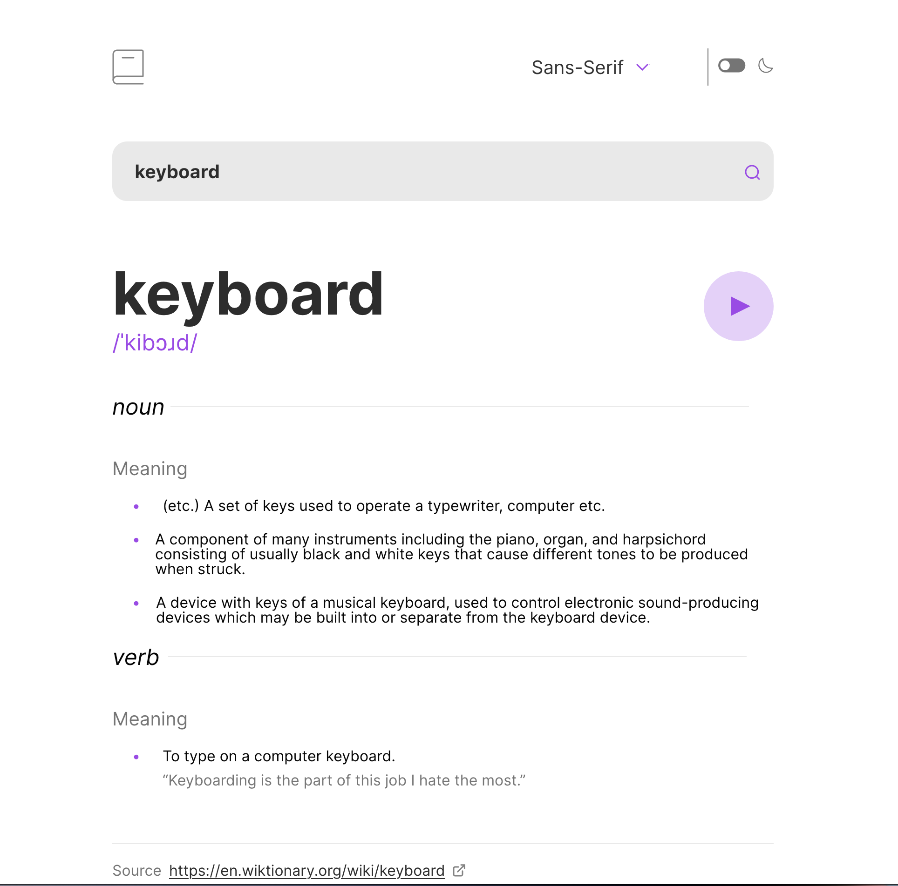

# Frontend Mentor - Dictionary web app solution

This is a solution to the [Dictionary web app challenge on Frontend Mentor](https://www.frontendmentor.io/challenges/dictionary-web-app-h5wwnyuKFL). Frontend Mentor challenges help you improve your coding skills by building realistic projects. 

## Table of contents

- [Overview](#overview)
  - [The challenge](#the-challenge)
  - [Screenshot](#screenshot)
  - [Links](#links)
- [My process](#my-process)
  - [Built with](#built-with)
  - [Personal goals](#personal-goals)
- [Author](#author)

## Overview

### The challenge

Users should be able to:

- Search for words using the input field
- See the Free Dictionary API's response for the searched word
- See a form validation message when trying to submit a blank form
- Play the audio file for a word when it's available
- Switch between serif, sans serif, and monospace fonts
- Switch between light and dark themes
- View the optimal layout for the interface depending on their device's screen size
- See hover and focus states for all interactive elements on the page
- **Bonus**: Have the correct color scheme chosen for them based on their computer preferences. _Hint_: Research `prefers-color-scheme` in CSS.

### Screenshot

### Links

- Solution URL: [https://github.com/anormandin/fm-dictionary](https://github.com/anormandin/fm-dictionary)
- Live Site URL: [https://fmdictionary.alainnormandin.dev](https://fmdictionary.alainnormandin.dev)

## My process

### Built with

- [React](https://reactjs.org/)
- [Vite](https://vitejs.dev/)
- [Sass](https://sass-lang.com/) 
- [Figma](https://www.figma.com)
- [React-Dropdown](https://www.npmjs.com/package/react-dropdown)

### Personal goals

I wanted to try using Sass with React. Sass is a great tool to write CSS with and I like using it. Separating the styles from
the components made it easy to style the application horizontally.

Although next time I will keep the styles inside the component files like I usually do.

## Author

- Frontend Mentor - [@anormandin](https://www.frontendmentor.io/profile/anormandin)